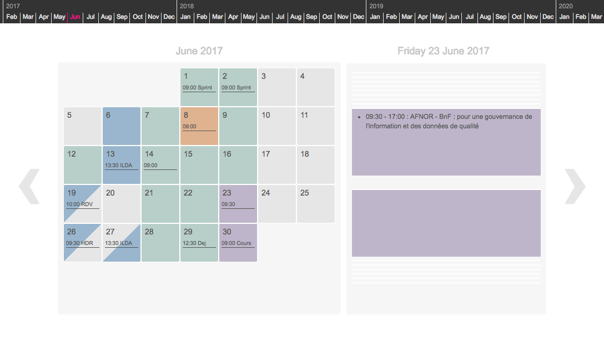
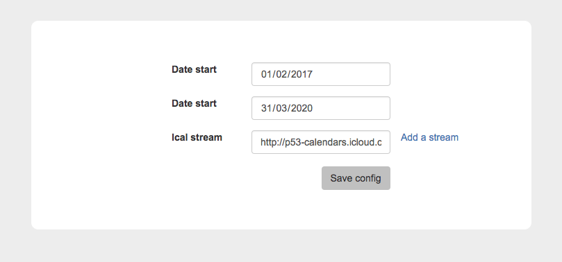
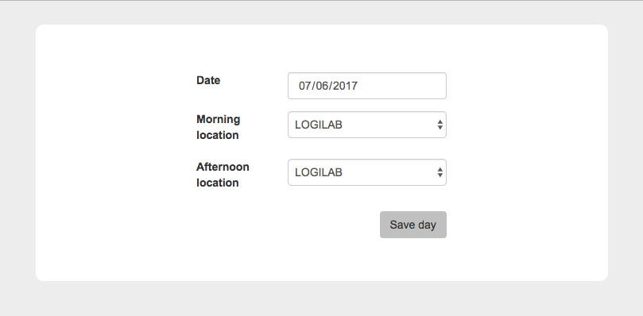

# Oto Calendar
A calendar with a background color for days,
useful when you have several work locations and need to know at first sight where you will be on a specific day

No edition tool for events, reads and displays ics streams

